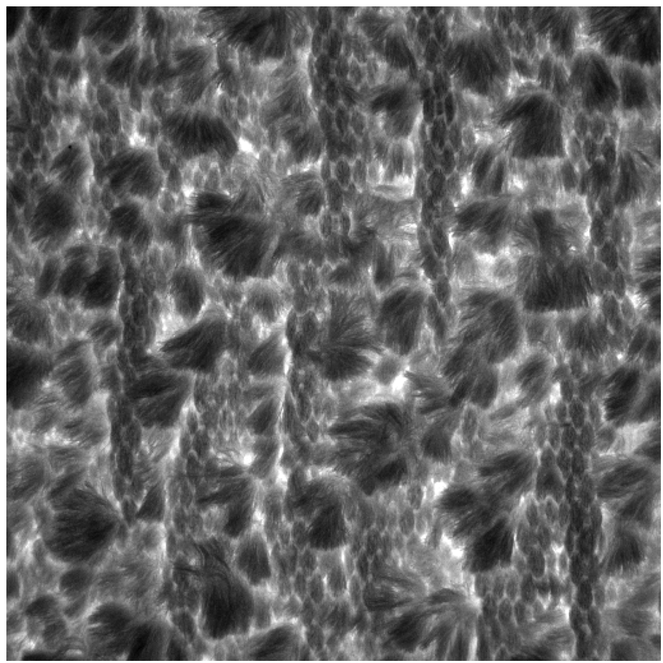
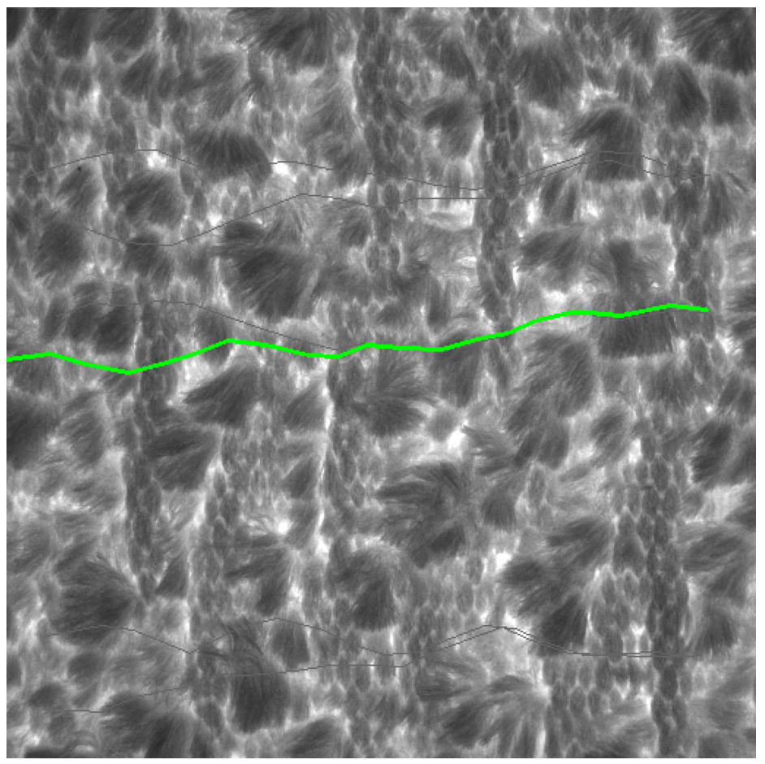

# Fabric Texture Detection

---

A fabric texture extraction method based on traditional computer vision

The innovation is to use an initial straight line to search for the fitting curve

# Result
    

